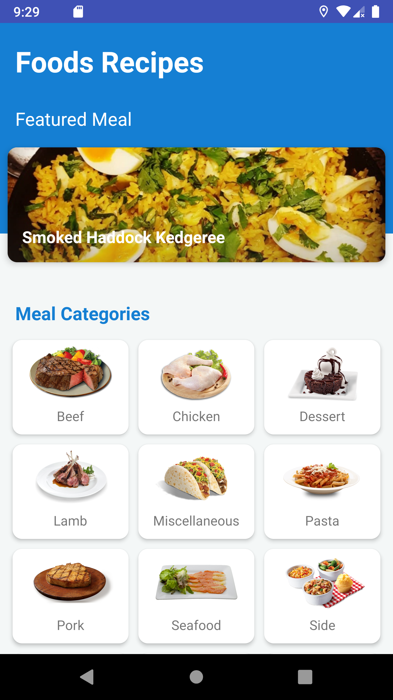

# Food Recipe App

**Food Recipe App** is an android application that shows recipes recommendation, detailed and categorized recipes, and promotional food from external source. This application use [themealdb](https://www.themealdb.com)
 as an external API.

Food Recipe Screen and Navigation Overview:

This application has three mains screen, which are home, category, and detail. We use buttons to navigate between those screens. From the homepage, you can navigate to the category page using a button with specific categories. You can also navigate to the detail page by clicking a menu that appears on the banner.
On the category page, you can select the menu by clicking the button that contains the name of the menu. You can navigate back to the previous screen using the back button.

Food Recipe Lifecycle overview:
* [onCreate()](https://developer.android.com/guide/components/activities/activity-lifecycle#oncreate): This method loads the splash screen when opening the app, set the user interface layout for HomeActivity, get meals and categories from API on HomeActivity, get data from intent to DetailActivity, and put the name of the meal name from the data intent to DetailPresenter.
* [onResume()](https://developer.android.com/guide/components/activities/activity-lifecycle#onresume): This method shows ads pop up from three random ads in HomeActivity.
* [onDestroy()](https://developer.android.com/guide/components/activities/activity-lifecycle#ondestroy): This method shows an exit app toaster when HomeActivity is finishing.

## Installation
Clone this repository to your local machine

```bash
git clone git@github.com:aldyrmbe/papb-team2.git
```

## Features
This android app lets you:
* View current recipe recommendation
* Find a specific food recipe
* Browse and explore lots of food categories 
* View detailed information about the recipe, such as instruction, ingredients, youtube video link, and other external link.

## Architecture Pattern
This app use MVP (Model View Presenter) android architecture pattern. The reason we use this architecture is that the data used comes from a third party. This application fetches the data using API from [themealdb](https://www.themealdb.com) and processes it, then presents it using our user interfaces.
In short, this application model fetches the data using API. The presenter takes care of the navigation and logic process as the middleman between model and view. Views are the UI for the data.
Another reason is that the codes are easier to understand and maintain.

## Permissions
This application requires full network access.

## Maintainers
This project is maintained by Team 2 of Pengembangan Aplikasi Piranti Bergerak subject, consist of:
* [Mhd Rizaldy Andrian Rambe](https://github.com/aldyrmbe) - 18/431397/TK/47990
* [Adib Wirawan P](https://github.com/Siradrawanp) - 18/429051/TK/47553
* [Virginia Putri Mori](https://github.com/virginiaritonga) - 18/431410/TK/48003
* [Fajar Ryan Akhra](https://github.com/ryanakhra2) - 18/425307/TK/47002

## Contributing
We currently only accept contributions from collaborators.

## Support
If you need assistance, please contact one of the following emails, with the subject "Ask - Food Recipe App":
1. mhdrizaldy@mail.ugm.ac.id (Aldy)
2. adib.w.p@mail.ugm.ac.id (Adib)
3. virginia.p.m@mail.ugm.ac.id (Virginia)
4. fajar.ryan.akhra@mail.ugm.ac.id (Ryan)

## License
[MIT](https://choosealicense.com/licenses/mit/)

## Screenshot
Home



Category Page


Detail Page 


Detail Page - 2 


Promo Banner


